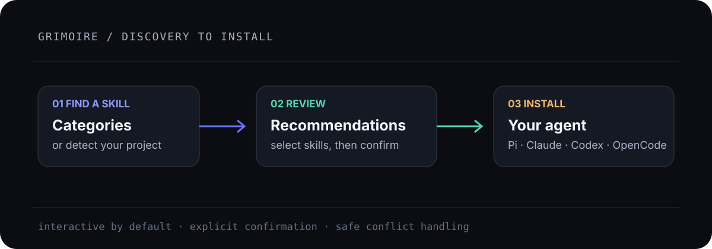

<p align="center">
  
</p>

<h1 align="center">Grimoire</h1>

<p align="center">A curated skill catalog and safe installer for coding agents.</p>

<p align="center">
  <a href="https://www.npmjs.com/package/@runecraft/grimoire"></a>
  <a href="https://www.npmjs.com/package/@runecraft/grimoire"></a>
  <a href="https://github.com/runecraftai/skills/actions/workflows/ci.yml"></a>
  <a href="https://github.com/runecraftai/skills/blob/main/LICENSE"></a>
</p>

Grimoire puts reusable `SKILL.md` workflows in the right place for your agent. Browse by category, detect what your project needs, review the selection, and confirm before anything is installed.

## Start here

```bash
npx @runecraft/grimoire
# or
bunx @runecraft/grimoire
```

The interactive flow is the default. It lets you choose a category or **Detect project skills**, select one or more skills, choose a destination, and confirm the install.

## Supported agents

- [Pi](https://github.com/badlogic/pi-mono)
- [Claude Code](https://docs.anthropic.com/en/docs/claude-code)
- [Codex CLI](https://github.com/openai/codex)
- [OpenCode](https://opencode.ai/)

## Commands

```bash
grimoire list                              # list catalog entries
grimoire search typescript                 # search names, descriptions, and categories
grimoire detect                            # recommend skills for this project
grimoire install -s spec-driven -t pi       # install without the TUI
grimoire install -s skill-forge -t codex --overwrite
```

The executable is `grimoire`. Run `grimoire --help` for all options. Repeat `-s` to install multiple skills; use `--target-dir` for an isolated destination.

## Why Grimoire

- **One catalog:** skills are organized into Build & Design, Testing & Quality, Security & Operations, Agent Craft, and Planning & Collaboration.
- **Project-aware:** detection reads common project files and recommends relevant skills.
- **Explicit installs:** existing skills are skipped by default; conflicts require an overwrite choice or `--overwrite`.
- **Trackable work:** project installs can be recorded in `.grimoire-lock.json`.

## Development

```bash
bun install
bun run lint
bun run test
bun run typecheck
bun run build
npm pack --dry-run --workspace @runecraft/grimoire
```

## License

MIT — see [LICENSE](LICENSE).
