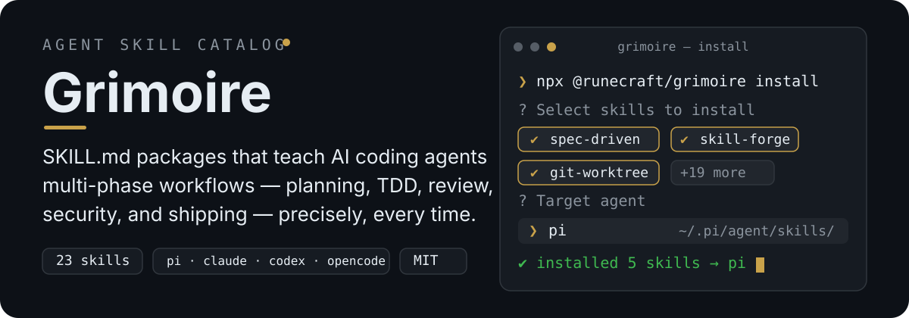
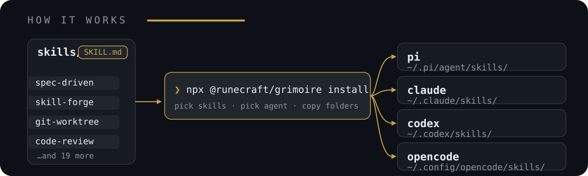

<p align="center">
  <a href="https://www.npmjs.com/package/@runecraft/skills"></a>
  <a href="LICENSE"></a>
</p>

<p align="center">
  
</p>

# Runecraft Skills

A catalog of agent skills: `SKILL.md` packages that teach AI coding agents to run specific, multi-phase workflows — planning, TDD, review, security, shipping — with the same precision every time, instead of ad-hoc prompting.

Each skill is a plain `SKILL.md` file (the core agent instructions) plus, optionally, a `references/` folder the agent loads on demand as it works through a phase. Skills are plain files you can read, diff, and version.

## Quick start

Run the interactive installer — no `npm install` needed:

```bash
npx @runecraft/skills install
```

`bunx` works too:

```bash
bunx @runecraft/skills install
```

The installer lists the catalog, multi-selects skills, picks the target agent, and copies the skill folders into that agent's skills directory. Already-installed skills are skipped by default; the flow asks whether to overwrite or skip, and `--overwrite` forces replacement.

If the package is installed locally, the same CLI is available as `runecraft-skills` (bare invocation also defaults to the installer):

```bash
runecraft-skills          # same as `runecraft-skills install`
runecraft-skills --list   # list the catalog and exit
```

Scripting (for CI or one-shot installs):

```bash
npx @runecraft/skills install --skill spec-driven --skill skill-forge --target pi
```

### Options

| Flag | Description |
|------|-------------|
| `-s, --skill <name>` | Skill to install (repeatable). |
| `-t, --target <id>` | Install target: `pi`, `claude`, `codex`, `opencode`. |
| `--target-dir <dir>` | Override the destination skills directory (scripting / CI). |
| `--overwrite` | Replace already-installed skills (default: skip them). |
| `-l, --list` | List the catalog skills and exit. |
| `-h, --help`, `-v, --version` | Help / version. |

### Install targets

The installer resolves each agent's skills directory, honoring the agent's own configuration conventions:

| Target | Skills directory | Convention |
|--------|------------------|------------|
| `pi` | `~/.pi/agent/skills/` | pi home: `$PI_HOME` (default `~/.pi`) |
| `claude` | `~/.claude/skills/` | Claude Code config dir: `$CLAUDE_CONFIG_DIR` (default `~/.claude`) |
| `codex` | `~/.codex/skills/` | Codex config dir: `$CODEX_HOME` (default `~/.codex`); the legacy-but-still-scanned location OpenAI's skill-installer targets. Codex CLI also reads the newer cross-agent `~/.agents/skills/` — point `--target-dir` there if you prefer it. |
| `opencode` | `~/.config/opencode/skills/` | XDG config home: `$XDG_CONFIG_HOME` (default `~/.config`) |

## How it works

One catalog, one installer, four agents:

<p align="center">
  
</p>

```text
@runecraft/skills/
├── skills/
│   ├── spec-driven/SKILL.md          # one directory per skill
│   ├── test-driven-development/SKILL.md
│   ├── code-review-and-quality/SKILL.md
│   └── ...                           # each with SKILL.md + optional references/ + scripts/
└── references/                       # shared docs: testing-patterns.md, definition-of-done.md
```

Works with any agent that supports custom instructions, skills, or rules directories.

## Available skills

| Skill | Description | Main Trigger | Docs |
|-------|-------------|--------------|------|
| **spec-driven** | Spec-driven planning with 4 adaptive phases (Specify/Design/Tasks/Execute) + independent Verifier (author≠verifier) + self-improving lessons layer | `/spec` | [→ README](skills/spec-driven/README.md) |
| **git-commit-learning** | RPI model: analyze git log for patterns and write AI-learnable commits (Research → Plan → Implement → Verify). PT/EN. | `/commit` | [→ README](skills/git-commit-learning/README.md) |
| **git-worktree** | Use git worktrees for parallel feature branches without stashing or cloning. | `/worktree` | [→ README](skills/git-worktree/README.md) |
| **using-agent-skills** | Meta-skill: discover and dispatch to the right catalog skill for the current task. | `/skill` | [→ README](skills/using-agent-skills/README.md) |
| **idea-refine** | Refine raw ideas through divergent/convergent thinking — expand options, stress-test assumptions. | `/ideate` | [→ README](skills/idea-refine/README.md) |
| **interview-me** | One-question-at-a-time interview until ~95% confidence about user intent. | `/interview` | [→ README](skills/interview-me/README.md) |
| **spec-loop** | Milestone-loop runner: drives every `.specs/` artifact to completion — ROADMAP → milestones → tasks → verification gates → atomic commits → STATE.md. PT/EN. | "execute the specs" | [→ README](skills/spec-loop/README.md) |
| **memory-management** | Lightweight agent memory for non-Guild projects. Maintains project decisions and error patterns in a flat .agent-memory/ directory. | `/memory` | [→ README](skills/memory-management/README.md) |
| **doubt-driven-development** | Adversarial review of non-trivial decisions: CLAIM → EXTRACT → DOUBT → RECONCILE → STOP. | `/harden` | [→ README](skills/doubt-driven-development/README.md) |
| **test-driven-development** | TDD with the 80/15/5 pyramid and Beyonce Rule. Fail first, then make it pass. | `/test` | [→ README](skills/test-driven-development/README.md) |
| **typescript-patterns** | TypeScript best practices and patterns for type-safe, maintainable code. | `/typescript` | [→ README](skills/typescript-patterns/README.md) |
| **debugging-and-error-recovery** | Five-step root-cause triage: reproduce → localize → reduce → fix → guard. | `/debug` | [→ README](skills/debugging-and-error-recovery/README.md) |
| **code-review-and-quality** | Five-axis code review (correctness, readability, architecture, security, performance) with severity labels. | `/review` | [→ README](skills/code-review-and-quality/README.md) |
| **code-simplification** | Reduce complexity while preserving behavior — Chesterton's Fence, Rule of 500. | `/simplify` | [→ README](skills/code-simplification/README.md) |
| **security-and-hardening** | OWASP Top 10 and a three-tier boundary system for security-first development. | `/security` | [→ README](skills/security-and-hardening/README.md) |
| **deprecation-and-migration** | Retire old systems, APIs, and features; migrate users safely. Treats code as liability. | `/deprecate` | [→ README](skills/deprecation-and-migration/README.md) |
| **shipping-and-launch** | Pre-launch checklist, staged rollout, feature flag lifecycle, monitoring, rollback. | `/ship` | [→ README](skills/shipping-and-launch/README.md) |
| **skill-forge** | Meta-skill for creating new Agent Skills end-to-end. Aligned with the open SKILL.md format. 6-phase workflow (Discover → Design → Author → Validate → Optimize → Deliver) with bundled validator and trigger/output eval methodology. | `/forge` | [→ README](skills/skill-forge/README.md) |
| **linkedin-audit** | Audita o perfil do LinkedIn (notas 0-10 em 8 seções, diagnósticos diretos, reescritas sugeridas) e gera um dashboard HTML standalone com as cores do LinkedIn. | "avalia meu perfil", "audita meu LinkedIn" | [→ SKILL.md](skills/linkedin-audit/SKILL.md) |

## References

Shared documents that complement the per-skill workflows:

| File | Description |
|------|-------------|
| [testing-patterns.md](references/testing-patterns.md) | Common testing patterns across the stack with 80/15/5 pyramid, Beyonce Rule, and 8 anti-patterns. |
| [definition-of-done.md](references/definition-of-done.md) | Project-wide standing bar that complements per-task acceptance criteria. |

## Why a SKILL.md instead of a longer system prompt

A system prompt has to hold everything all the time, so it either stays generic or grows until it's expensive and hard to steer. A skill is loaded only when its trigger matches the task, and it's a plain file you can read, diff, and version — the same TDD process doesn't need to be re-explained by hand in every project's prompt.

## Manual install

You can also install skills manually, without the installer:

```bash
# after `npm install @runecraft/skills`
cp -r node_modules/@runecraft/skills/skills/spec-driven ~/.pi/agent/skills/spec-driven
```

## License

MIT
